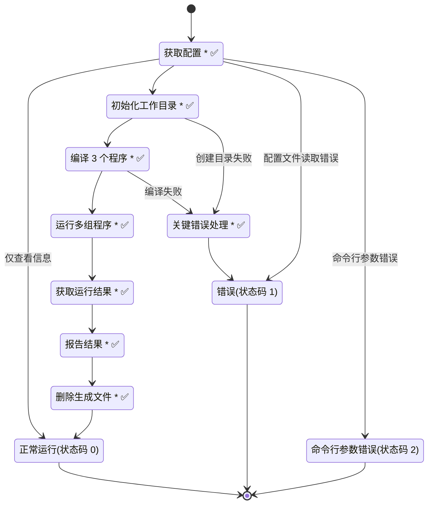
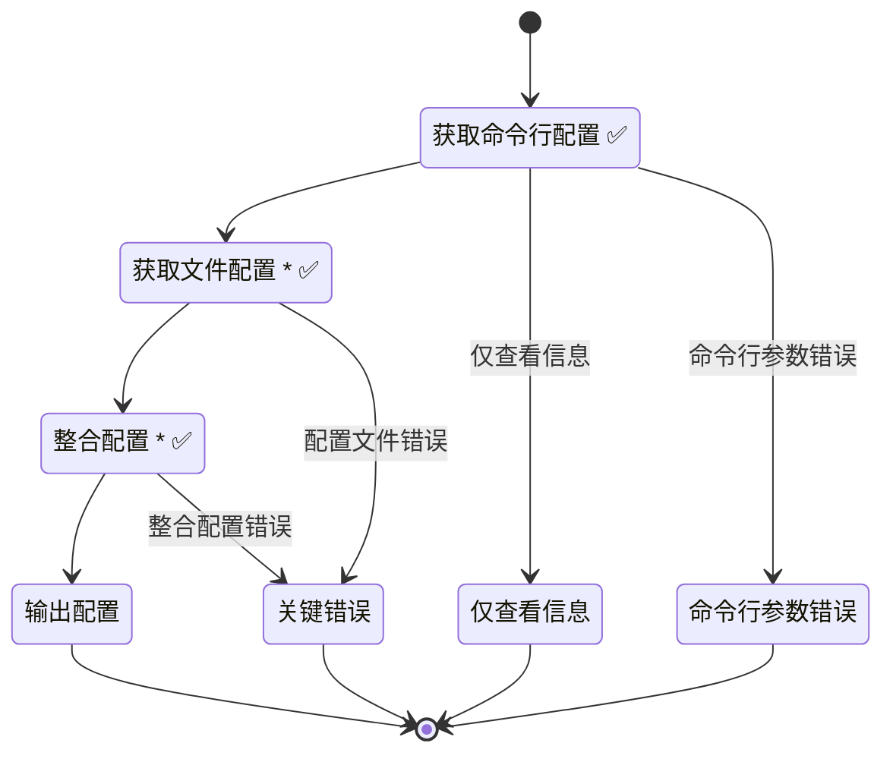
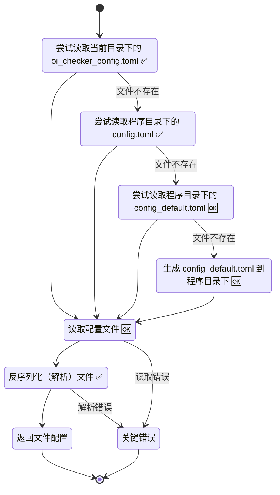
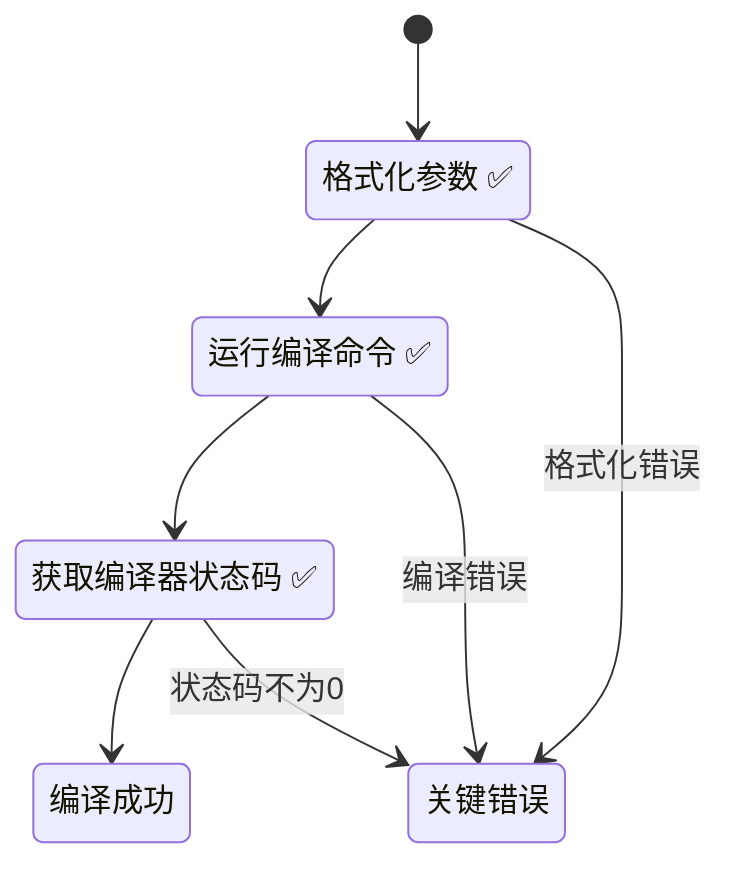

# 程序运行流程

> 注：步骤后的❌表示尚未实现，⏳表示开发中或未经验证，✅表示开发完成且已验证，🆗表示已通过系统性测试。
>
> 为简化图表，箭头默认为该步骤执行成功后的行为；如无特别标注错误处理，均默认传给上一级程序进行处理。
>
> 步骤末尾的 `*` 表示详见下方备注。

## 总览 Overview

备注：

- 获取配置：详见[获取配置 Get Configuration](#获取配置-get-configuration)
- 初始化工作目录：检测目录是否存在，如不存在则创建。
- 编译 3 个程序：即尝试编译数据生成器、正确程序、待测程序。单次编译详见[编译程序 Compile Program](#编译程序-compile-program)
- 运行多组程序：根据运行配置中`test_cases`组程序组，单组运行详见[TODO]
- 获取运行结果：详见[TODO]
- 报告结果：将 `AC` `UK` `TLE` `WA` 为结果的样例数及总样例数彩色输出到终端中。
- 删除生成文件：详见[TODO]
- 关键错误处理：详见[TODO]

## 获取配置 Get Configuration

备注：

- 获取文件配置：详见[获取文件配置 Get File Config](#获取文件配置-get-file-config)
- 整合配置：即以配置文件内容为基础，将传递的命令行参数覆盖，并对配置加以校验，校验失败则抛出错误。

## 获取文件配置 Get File Config

## 编译程序 Compile Program

